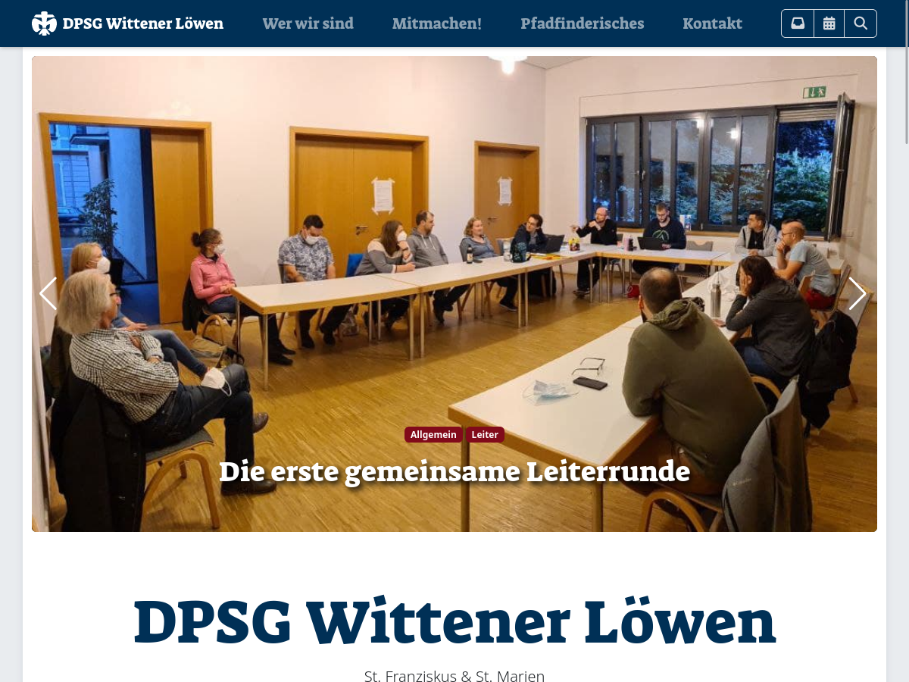

# bootScore DPSG

Ein WordPress-Child-Theme, basierend auf [bootScore](https://github.com/bootscore/bootscore), das dem [DPSG](https://dpsg.de/) [Corporate Design Leitfaden](http://www.dpsg.de/sites/default/files/2021-04/dpsg_corporate_design_leitfaden.pdf) folgt.

Das Theme beinhaltet passende [Scoutnet-Kalender](https://github.com/weed-/scoutnet-kalender)-Templates (Inline sowie Widget)

## Installation

1. Neueste [bootscore-main.zip](https://github.com/bootscore/bootscore/releases)-Version herunterladen.
2. Neueste [bootscore-dpsg-main.zip](https://github.com/phil-bot/bootscore-dpsg/releases)-Version herunterladen.
3. Gehe in der Verwaltungskonsole zu `Design` > `Themes` und klicke auf die Schaltfläche `Theme hinzufügen`.
4. Klicke auf `Theme hochladen`, `Durchsuchen...` und wähle dann die `bootscore-main.zip`-Datei. Danach auf `Jetzt installieren`.
5. Klicke wieder auf `Theme hochladen`, `Durchsuchen...` und wähle dann die `bootscore-dpsg-main.zip`-Datei. Danach auf `Jetzt installieren`.
6. Zum schluss nur noch auf `Aktivieren` klicken, um das neues Theme sofort zu verwenden.

## Ein paar Eindrücke

### Live-Demo

Demnächst ist hier eine Live-Demo zu sehen: https://dpsg-witten.de

Plugins in der Live-Demo:

 - Scoutnet Kalender
 - Contact Form 7
 - bS Contact Form 7
 - bS Grid
 - bS Swiper
 - bS Gutenberg Gallery Lightbox
 - bS Gutenberg Responsive Video
 - Sticky Posts - Switch

### Bilder

